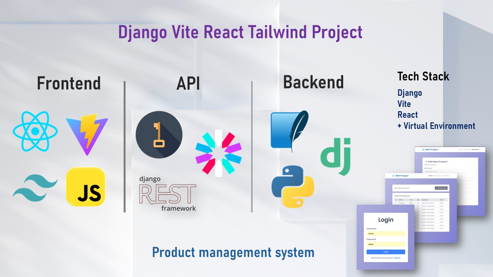
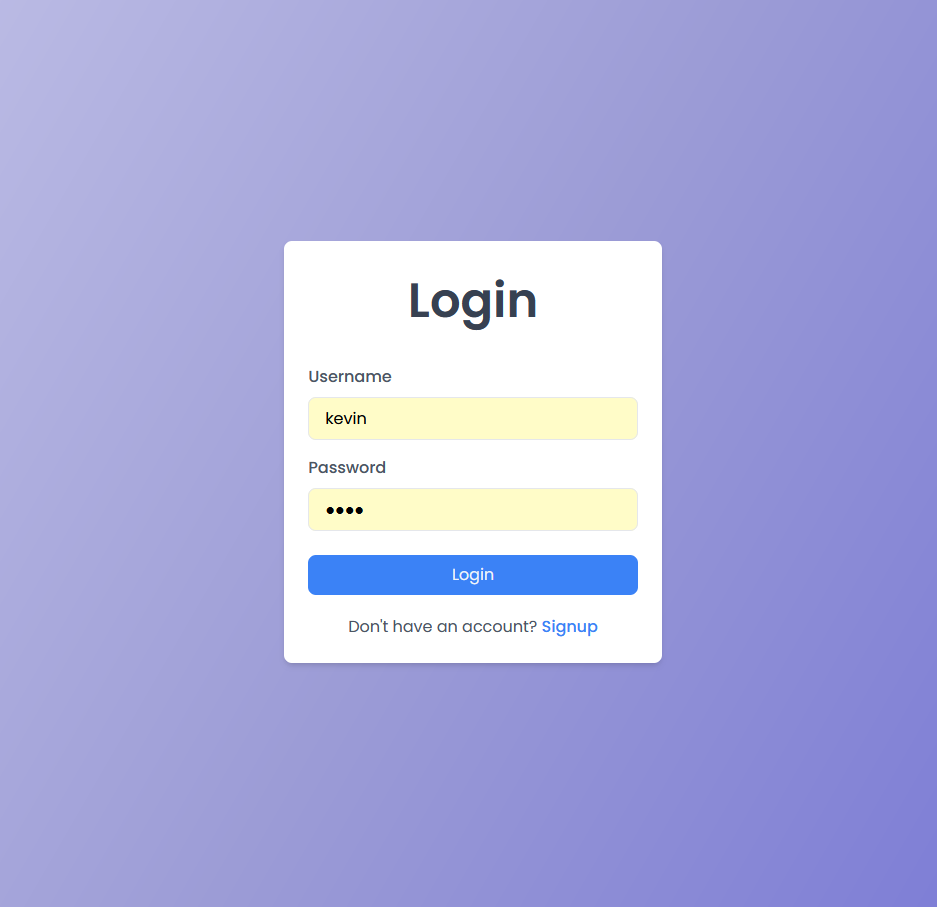
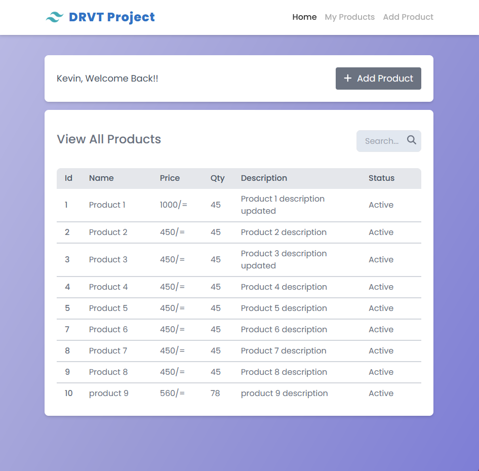
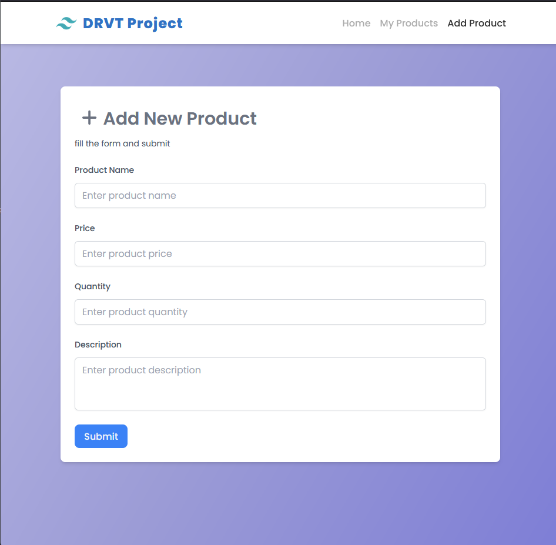
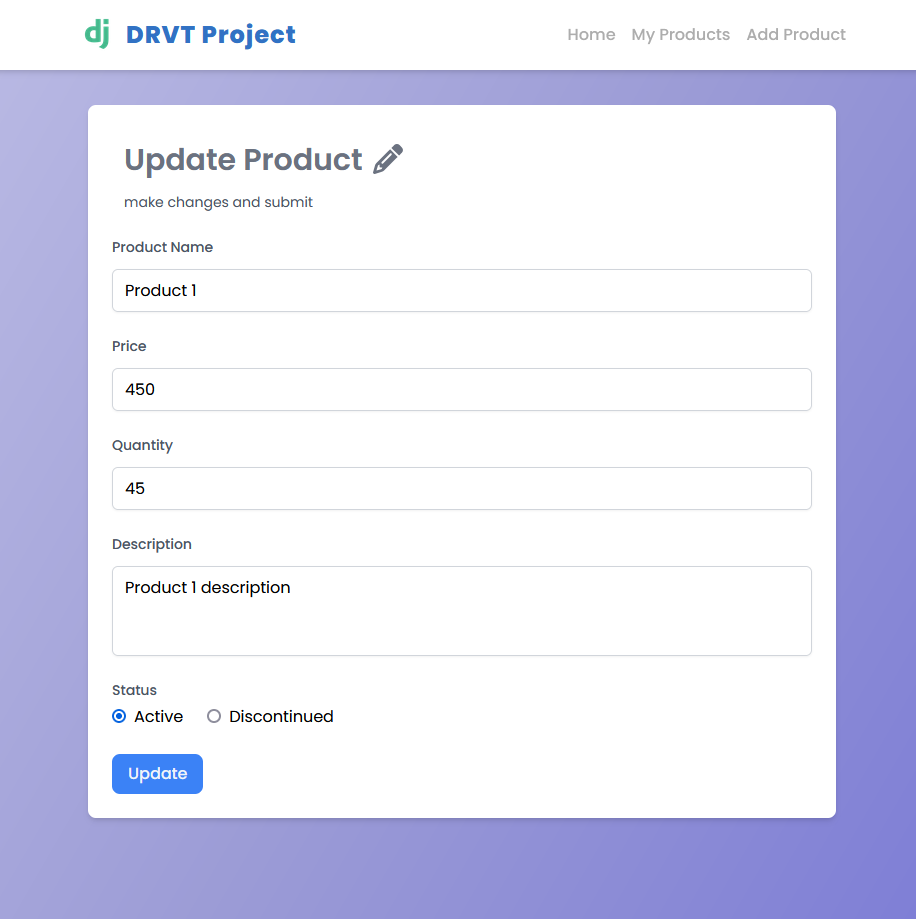

# 🚀 Django Vite React Tailwind Project

A full-stack web application for managing products with **User Authentication** and **Authorization**. Built with **Django REST Framework** for the backend and **Vite + React + Tailwind CSS** for the frontend. Fully _**Optimized Code**_ with _**Responsive Seding**_.



## 🌟 Features

### User Authentication

- 👤 Register: Create a new user account.
- 🔑 Login: Authenticate and access the system.
- 🚪 Logout: Securely log out of the system.

### Product Management

- 🛒 Add Product: Add a new product to the system.
- 🗑️ Delete Product: Remove a product from the system.
- ✏️ Edit Product: Update product details (only the author can edit).
- 👀 View Products: Browse all products in the system.
- 🔎 Search Products: Search products by name, id, description.

### Authorization

- 🔒 Only the author of a product can edit or delete it.

## 🛠️ Tech Stack

### Backend

- 🐍 **Python:** Programming language.
- 🎯 **Django:** Web framework.
- 🔄 **Django REST Framework (DRF):** For building RESTful APIs.
- 🔐 **Token Authentication:** Secure user authentication.

### Frontend

- ⚡ **Vite:** Fast build tool for React.
- ⚛️ **React:** JavaScript library for building user interfaces.
- 🎨 **Tailwind CSS:** Utility-first CSS framework for styling.
- 🔄 **Axios:** For making HTTP requests to the backend.

## 🚀 Getting Started

### Prerequisites

- Python 3.x
- Node.js
- npm or yarn

## Backend Setup

1. Clone the repository:

```bash
git clone https://github.com/kevinThulnith/dvrt-project.git
```

2. Create a virtual environment:

```bash
python -m venv venv
source venv/bin/activate  # On Windows: .\venv\Scripts\activate
```

3. Install dependencies:

- install postgressSQL and c++ buid tool first.

```bash
pip install -r requirements.txt
```

4. Run migrations:

```bash
python manage.py migrate
```

5. Start the Django development server:

```bash
python manage.py runserver
```

6. Access the backend API at:

```bash
http://localhost:8000/
```

## Frontend Setup

1. Navigate to the frontend directory:

```bash
cd ../frontend
```

2. Install dependencies:

```bash
npm install
```

3. Start the Vite development server:

```bash
npm run dev
```

4. Access the frontend at:

```bash
http://localhost:5173/
```

## 📂 Project Structure

### Backend

```bash
backend/
├── manage.py
├── products/
│   ├── models.py          # Product model
│   ├── serializers.py     # Product serializer
│   ├── views.py           # Product views
│   └── urls.py            # Product URLs
├── users/
│   ├── models.py          # User model
│   ├── serializers.py     # User serializer
│   ├── views.py           # User views
│   └── urls.py            # User URLs
└── settings.py            # Django settings
```

### Frontend

```bash
frontend/
├── src/
│   ├── components/        # Reusable components
│   ├── pages/             # Pages (Login, Register, Product List, etc.)
│   ├── api/               # Axios API calls
│   ├── App.jsx            # Main application component
│   └── main.jsx           # Entry point
├── public/                # Static assets
└── tailwind.config.js     # Tailwind CSS configuration
```

## 🔐 Authentication Flow

- Register: Users can create an account by providing their details.
- Login: Users log in with their credentials and receive an authentication token.
- Protected Routes: Only authenticated users can access product management features.
- Logout: Users can log out, and their token is invalidated.

## 🛒 Product Management Flow

- Edit Product: Only the author of a product can edit its details.
- Delete Product: Only the author of a product can delete it.
- Add Product: Authenticated users can add a new product.
- View Products: All users can view the list of products.
- Search products: All users can search the list of products.

## 🧪 Testing

### Backend

- Run the Django test suite:

```bash
python manage.py test
```

### Frontend

- Run the React tests:

```bash
npm test
```

## 📝 API Endpoints

### Users

- `POST /api/user/register/` - Register a new user.
- `POST /api/token/` - Log in and get an authentication token.
- `POST /api/token/blacklist/` - Log out and invalidate the token.

### Products

- `GET /api/products/all/` - Get a list of all products.
- `POST /api/products/` - Add a new product (authenticated users only).
- `GET /api/products/<id>/` - Get details of a specific product.
- `PUT /api/products/update/<id>/` - Update a product (author only).
- `DELETE /api/products/delete/<id>/` - Delete a product (author only).

## 📸 Screenshots

### Login Page



### Product List



### Add Product



### Update Product



## 🤝 Contributing

Contributions are welcome! Please follow these steps:

- Fork the repository.
- Create a new branch (git checkout -b feature/YourFeature).
- Commit your changes (git commit -m 'Add some feature').
- Push to the branch (git push origin feature/YourFeature).
- Open a pull request.

## 📜 License

This project is licensed under the MIT License. See the LICENSE file for details.
🙏 Acknowledgments

- Django REST Framework for the powerful backend.
- Vite and React for the blazing-fast frontend.
- Tailwind CSS for the beautiful and responsive design.

Made with ❤️ by Kevin Thulnith
🚀 Happy coding! 🚀
